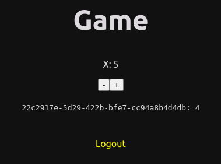
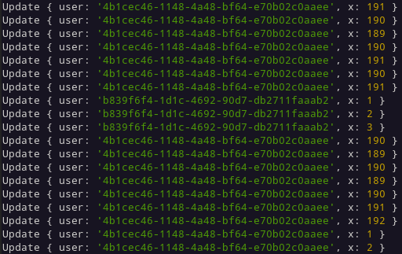

# PhaserBeams (NextJS & Socket.IO)

This is an experiment in combining various technologies together in the effort to make a simple novel online multiplayer game. The various components of the project are as follows:

- [Next.js](https://nextjs.org/) web application
  - Multi-user frontend user interface
  - Modern React based framework
  - Easily hostable at [Vercel](https://vercel.com/)
- [Socket.IO](https://socket.io/) websocket messaging
  - Realtime event subscriptions
- [WLED](https://kno.wled.ge/) LED Controller
  - Separate controller service
  - Polls Socket.IO subscriptions
  - Updates LED strips using WLED [realtime UDP protocol](https://kno.wled.ge/interfaces/udp-realtime/)

## Usage

TODO

## Game Concepts

The games must be extremely simple as they must be rendered on a 1-dimensional LED strip.

Initial work will be implementing the required multiplayer environment and realtime subscription updates to the LED strip.

## Examples / Screenshots

Prototype web interface

WLED realtime subscriber service

## Development

To develop and run the Next.js development server:

    npm install
    npm run dev

To start the LED controller service:

    node wled.js
